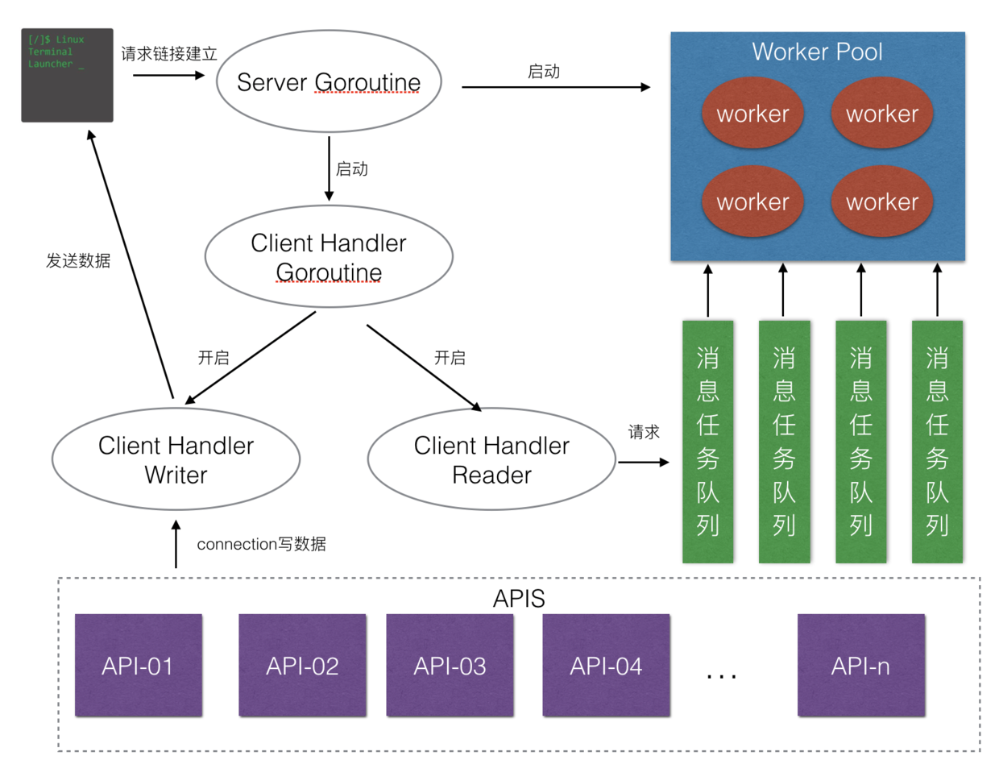
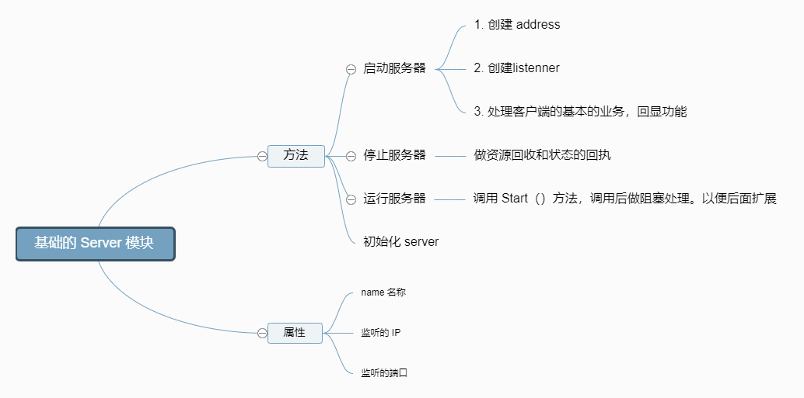

# zinx 框架

## 架构设计
先来模拟一下一个客户端请求服务器响应的过程：

1. 要有一个客户端对服务器发起请求。
2. 我们的服务器应该去启动对客户端的处理模块并打开工作池来提升并发量。
3. 处理客户端的模块开启两个模块，一个负责读客户端请求，一个负责写客户端请求。
4. 用于读的功能模块，去任务的消息队列里去请求读数据。用于写的功能模块，通过 API 接口，当然我们的 API 不可能只有一个，所以这里肯定是 APIS。

这个过程就是 Zinx 官方架构图中的一个流程：

Zinx 作为一个轻量级框架，虽然轻便，但是却可以满足以上的过程，所以是具生产力的框架。

## server 模块
server 模块基本功能思维导图

