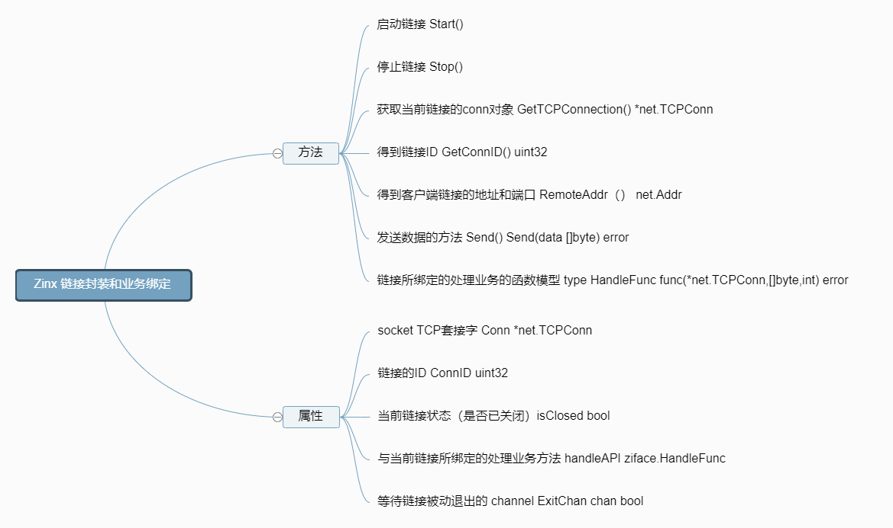
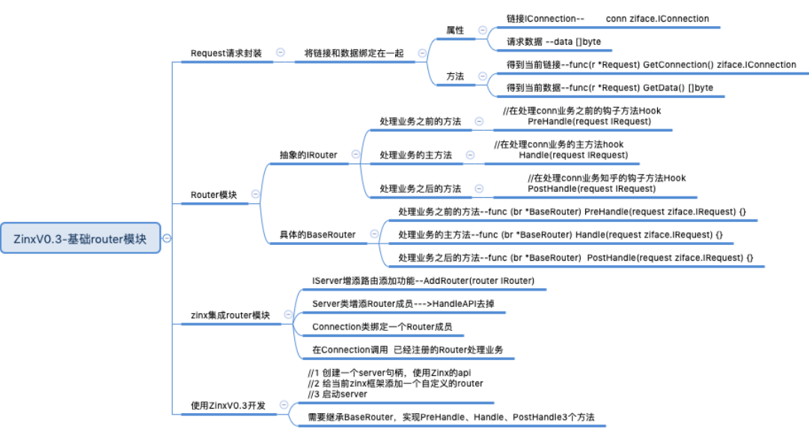
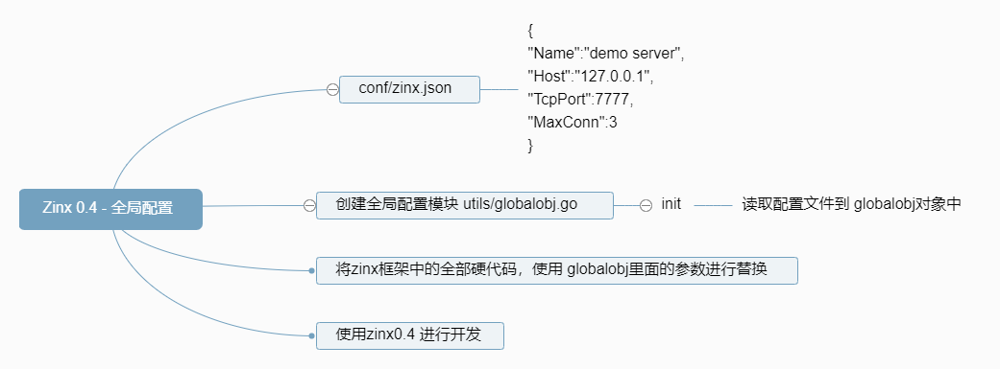
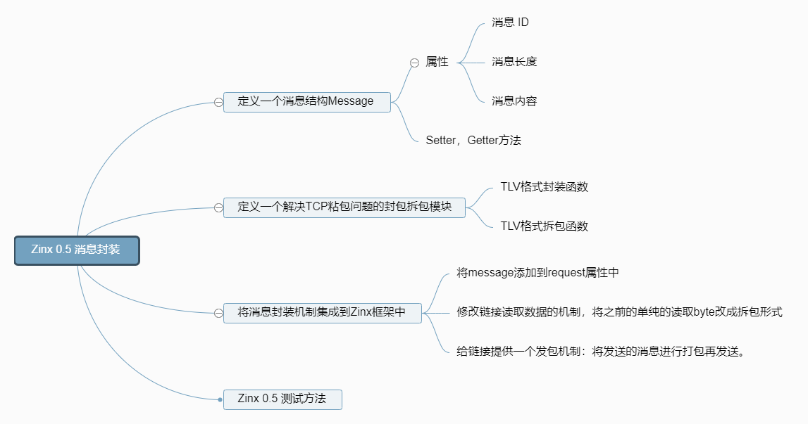
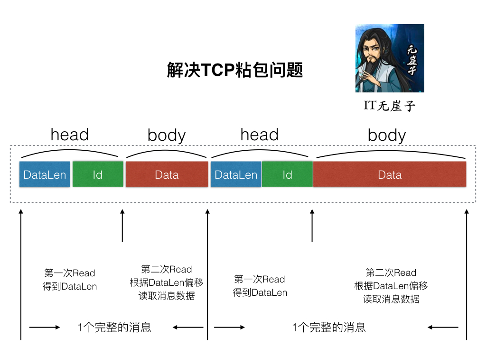

# zinx 框架

## 架构设计
先来模拟一下一个客户端请求服务器响应的过程：

1. 要有一个客户端对服务器发起请求。
2. 我们的服务器应该去启动对客户端的处理模块并打开工作池来提升并发量。
3. 处理客户端的模块开启两个模块，一个负责读客户端请求，一个负责写客户端请求。
4. 用于读的功能模块，去任务的消息队列里去请求读数据。用于写的功能模块，通过 API 接口，当然我们的 API 不可能只有一个，所以这里肯定是 APIS。

这个过程就是 Zinx 官方架构图中的一个流程：

Zinx 作为一个轻量级框架，虽然轻便，但是却可以满足以上的过程，所以是具生产力的框架。

## server 模块
server 模块基本功能思维导图

## 链接封装和业务绑定
链接封装和业务绑定思维导图

## 路由功能模块

## 全局配置模块

## 消息封装模块

采用经典的 TLV(Type-Len-Value)封包格式来解决 TCP 粘包问题。

由于 Zinx 也是 TCP 流的形式传播数据，难免会出现消息 1 和消息 2 一同发送，那么 zinx 就需要有能力区分两个消息的边界，所以 Zinx 此时应该提供一个统一的拆包和封包的方法。在发包之前打包成如上图这种格式的有 head 和 body 的两部分的包，在收到数据的时候分两次进行读取，先读取固定长度的 head 部分，得到后续 Data 的长度，再根据 DataLen 读取之后的 body。这样就能够解决粘包的问题了。